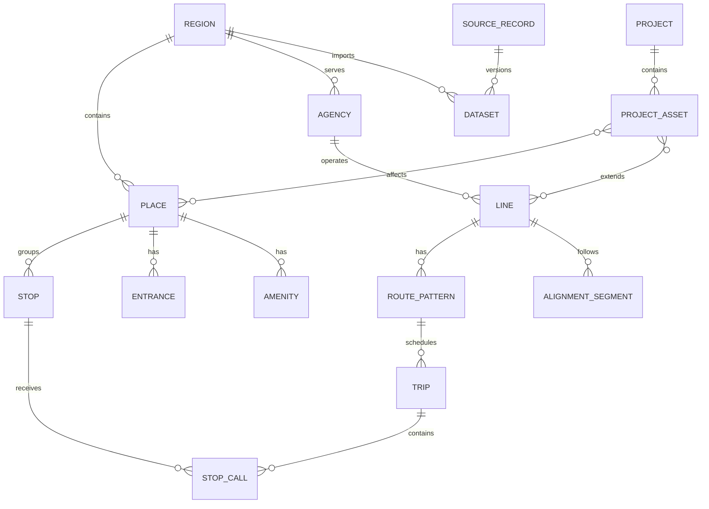
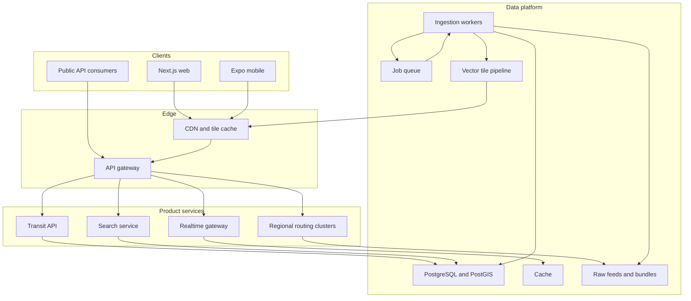

# Worldwide Public Transit Atlas — Product and Platform Plan

**Status:** Initial planning document  
**Reference launch city:** Chennai, India  
**First agency:** Chennai Metro Rail Limited (CMRL)  
**Primary web client:** Next.js  
**Planned mobile clients:** iOS and Android via React Native/Expo  
**Last updated:** 2026-07-16

---

## 1. Executive summary

The product should be built as a worldwide public-transit platform whose first complete implementation happens to be Chennai Metro—not as a Chennai-specific website that is generalized later.

The core product is a **living transit atlas**: a fast, beautiful, map-first experience that helps people understand a city's transit network as it operates today, how to use it, how it is changing, and how it connects to the wider city.

The platform should support:

- Operational, suspended, under-construction, approved, and proposed infrastructure.
- Metro, rail, tram, bus, ferry, cable transit, and shared-mobility modes.
- Static schedules, real-time arrivals, vehicle positions, and service alerts when published.
- Geographic and schematic representations of the same network.
- Station, stop, route, line, project, and city profiles.
- Multimodal journey planning.
- Local languages, scripts, time zones, currencies, and accessibility conventions.
- Web, iOS, and Android clients backed by the same normalized data and APIs.
- Graceful operation in cities with excellent data and cities with incomplete data.
- Strong source attribution, licensing controls, freshness indicators, and editorial review.

The architectural principle is:

> Ingest many formats, normalize them into one source-aware transit model, and serve every client from stable platform APIs.

Chennai is a strong first city because CUMTA publishes GTFS data and CMRL publishes official maps, project reports, passenger information, construction material, and ridership information. It also forces the platform to solve important global problems early: multilingual names, planned infrastructure, inconsistent source totals, multimodal interchange, varying station-detail quality, and incomplete real-time data.

---

## 2. Product vision

### 2.1 The promise

For any supported city, a person should be able to answer:

- What transit exists here?
- Where does each line go?
- Which stations and stops serve a place?
- How do I travel from A to B?
- Is service operating normally?
- What does this station offer?
- How accessible is the journey?
- How does the network connect with buses, regional rail, ferries, and shared mobility?
- What is being built next?
- Which proposals are approved, funded, under study, or merely conceptual?
- Where did each fact come from, and how current is it?

### 2.2 Product personality

The product should feel like a combination of:

- A world-class transit map.
- A practical journey-planning tool.
- An urban-planning atlas.
- A trustworthy, sourced public-data explorer.

It should not feel like a generic business dashboard placed around a map. The network is the interface.

### 2.3 Target audiences

1. **Everyday riders** — routes, arrivals, disruptions, fares, accessibility, and station facilities.
2. **Visitors** — network orientation, landmarks, airport connections, ticketing, and clear local-language support.
3. **Transit enthusiasts** — infrastructure, rolling stock, line history, depots, extensions, and detailed maps.
4. **Urbanists and researchers** — downloadable data, ridership, project status, network growth, and comparisons.
5. **Transit agencies** — a high-quality public presentation of official data, with attribution and correction workflows.

The first release may emphasize exploration and commuters, but the domain model should not prevent the later audiences.

---

## 3. Scope boundaries

### 3.1 What the platform is

- A worldwide catalog of public-transit networks.
- A source-aware map and data explorer.
- A journey-planning client where adequate data exists.
- A publishing system for current and future transit infrastructure.
- A common backend for web and mobile products.

### 3.2 What it is not initially

- A ticket retailer or payment processor.
- A replacement for agency operational-control systems.
- A crowdsourced navigation network with unverified facts.
- A promise of real-time coverage in cities that do not publish real-time feeds.
- A social network.
- A platform for inferring construction completion dates from rumors.

Payments, reservations, ticket wallets, and agency partnerships can be added later behind explicit provider adapters.

---

## 4. Global scale model

Worldwide scaling is not primarily a page-rendering problem. It is a **data heterogeneity, identity, routing, licensing, and operational-isolation problem**.

The platform should scale across four axes:

1. **Coverage scale** — thousands of cities and agencies.
2. **Data scale** — schedules, shapes, stop times, real-time updates, imagery, and historical snapshots.
3. **Traffic scale** — popular cities, commute peaks, incidents, and viral map stories.
4. **organizational scale** — automated imports plus human curation and agency corrections.

### 4.1 Isolation unit

Use a `region` as the primary operational unit. A region is usually a metropolitan area but can be a national network, state, island, or cross-border service area.

Examples:

- `in-maa` — Chennai metropolitan region.
- `gb-lon` — London.
- `jp-tokyo` — Greater Tokyo.
- `ch-national` — Swiss national public transport.
- `us-nyc` — New York metropolitan area.

Each region owns:

- One or more agencies and feeds.
- A geographic boundary and default viewport.
- A time zone and supported locales.
- A routing graph version.
- A tile/data bundle version.
- Data-quality and freshness status.
- Region-specific overrides.

This allows one broken feed or graph rebuild to be quarantined without affecting the world.

### 4.2 City support tiers

Do not pretend all cities have equal data. Publish a visible capability tier:

| Tier | Capabilities |
|---|---|
| Catalog | City, agencies, basic lines/stations, source links |
| Map | Validated stops, route shapes, geographic exploration |
| Schedule | Service calendars, departures, first/last services |
| Journey | Working multimodal routing graph |
| Live | Fresh GTFS-Realtime or equivalent arrivals/alerts/vehicles |
| Atlas+ | Curated future projects, ridership, station facilities, history |

Capabilities should be calculated from verified data, not enabled manually through optimistic flags.

### 4.3 Progressive regional onboarding

A new region should pass through:

1. Feed discovery.
2. License review.
3. Automated download and validation.
4. Identity matching and deduplication.
5. Geographic sanity checks.
6. Routing graph build.
7. Automated preview.
8. Human review for public launch.
9. Recurring refresh and change monitoring.

This makes worldwide expansion repeatable rather than a series of one-off coding projects.

---

## 5. Data-source strategy

### 5.1 Standards-first inputs

Preferred source order:

1. Official agency or transport-authority feeds.
2. Official regional/national open-data portals.
3. The Mobility Database for feed discovery and metadata.
4. OpenStreetMap for pedestrian networks, geography, and supplemental infrastructure.
5. Official plans, project reports, GIS files, and press releases.
6. Carefully reviewed community data where official data is unavailable.

GTFS is the main interchange format for schedules. MobilityData describes it as the de facto public-transit passenger-information standard and maintains a global feed directory. Its public materials report thousands of transit and shared-mobility feeds, making it useful for discovery—but the platform should still preserve and prefer the original publisher URL.

### 5.2 Supported input families

#### Initial

- GTFS Schedule.
- GTFS-Realtime: Trip Updates, Vehicle Positions, and Alerts.
- GeoJSON.
- KML/KMZ.
- Shapefile/GeoPackage through an import conversion step.
- GBFS for bike/scooter/shared-mobility status.
- Structured CSV/JSON agency datasets.
- Curated project records derived from official documents.

#### Later or market-specific

- NeTEx and SIRI, common in parts of Europe.
- TransXChange and related UK sources.
- Generalized Transit Feed Specification extensions.
- National or vendor APIs with explicit adapters.
- Agency-specific XML, protobuf, and JSON APIs.

All adapters output the canonical model. Clients must never need to understand an agency-specific format.

### 5.3 Current versus future infrastructure

GTFS represents service, not the complete lifecycle of infrastructure. Future projects therefore require a parallel, curated project model.

Every future asset must include:

- Status vocabulary.
- Official source.
- Source publication date.
- Geometry precision.
- Approval/funding state.
- Expected opening date, if officially published.
- Confidence and last review date.
- Relationship to an existing or future line.

Recommended status vocabulary:

```ts
type InfrastructureStatus =
  | "operational"
  | "temporarily-closed"
  | "suspended"
  | "testing"
  | "under-construction"
  | "contract-awarded"
  | "funded"
  | "approved"
  | "dpr"
  | "feasibility-study"
  | "proposed"
  | "cancelled"
  | "historical";
```

Statuses are deliberately more precise than `current` and `future`. The UI may group them, but the database should preserve the distinction.

### 5.4 Geometry precision

Every imported or curated geometry should declare one of:

- `surveyed` — authoritative engineering/GIS geometry.
- `schedule-shape` — shape supplied in a service feed.
- `digitized-official` — traced from an official published map or plan.
- `osm-matched` — aligned to OpenStreetMap infrastructure.
- `schematic` — topologically meaningful but not geographically exact.
- `approximate` — only broad alignment is known.

Approximate proposed lines should never visually imply engineering-level certainty.

### 5.5 Source provenance

Every material fact should be traceable through a `source_record` containing:

- Publisher.
- Canonical URL.
- License and attribution requirements.
- Publication timestamp when available.
- Retrieval timestamp.
- File checksum.
- Feed version or ETag.
- Importer version.
- Validation result.
- Geographic scope.
- Fields derived from the source.

Derived records should preserve a chain back to all contributing sources.

### 5.6 Licensing gate

No source moves to production until its usage status is known:

- Allowed with attribution.
- Allowed with share-alike obligations.
- Allowed for non-commercial use only.
- Permission required.
- Metadata-only discovery.
- Prohibited/unknown.

Store license decisions per source and per artifact. Data export, caching, tile creation, and redistribution may have different permissions.

---

## 6. Canonical transit domain model

The canonical model must be richer than raw GTFS while maintaining direct mappings to it.



### 6.1 Geographic hierarchy

- `country`
- `administrative_area`
- `region`
- `locality`
- `place`

A place can represent a station complex, terminal, ferry pier, or grouped stop area. Individual platforms, poles, entrances, and boarding locations are child stops or entrances.

### 6.2 Core entities

#### Region

- Stable platform ID and slug.
- Localized name.
- Boundary and center.
- Time zone.
- Default locale and supported locales.
- Currency.
- Measurement system.
- Capability flags.
- Data-health state.

#### Agency

- Stable platform ID.
- Source IDs by feed.
- Localized name.
- Operator versus authority role.
- Branding and contact details.
- Modes.
- License/source relationships.

#### Line

A passenger-recognizable service identity, such as Chennai Blue Line or London Victoria line.

- Localized names and short names.
- Color and text color.
- Mode.
- Operator.
- Lifecycle status.
- Public identity aliases.
- Ordered route patterns.
- Schematic metadata.

#### Route pattern

A direction and stop-pattern variant of a line. This prevents branches, short workings, express patterns, and loops from being flattened into one inaccurate sequence.

#### Place and stop

Separate the station complex from boarding positions:

- `place`: Chennai Central Metro complex.
- `stop`: Blue Line platform toward Airport.
- `entrance`: street-level entrance B2.

This supports GTFS Pathways, accessibility routing, platform-specific departures, and correct interchanges.

#### Trip and stop call

- Service date/calendar.
- Arrival and departure time.
- Pickup/drop-off rules.
- Platform.
- Headsign.
- Accessibility and bicycle rules.
- Real-time relationship.

#### Project

- Project name and aliases.
- Sponsor and agencies.
- Lifecycle status.
- Description.
- Dates and milestones.
- Cost with currency, price year, and source.
- Funding/approval state.
- Sections, stations, depots, and alignments.
- Official updates and media.

#### Service alert

- Affected agencies, lines, trips, stops, and geographies.
- Severity and cause/effect.
- Active period.
- Localized header and description.
- Source and last update.

### 6.3 Stable identity

Source IDs are not globally stable. Agencies rename stops, regenerate feed IDs, split feeds, and merge platforms.

Use two identifier layers:

- Internal immutable UUID/ULID.
- External identifier mappings scoped to source and version.

Identity matching should use:

- Previous source ID mappings.
- Parent-station relationships.
- Normalized localized names.
- Coordinates within mode-specific tolerances.
- Route membership.
- Platform codes.
- Manual merge/split decisions.

Never expose raw feed IDs as permanent public URLs. Public slugs should resolve through stable internal identities and retain redirects after renames.

### 6.4 Localization

Names and descriptions should be stored as localized values, not `name_en`, `name_ta`, and an ever-growing set of columns.

```ts
type LocalizedText = {
  languageTag: string; // BCP 47, e.g. en, ta, zh-Hant
  value: string;
  sourceId: string;
  transliteration?: boolean;
};
```

The model must support:

- Multiple local scripts.
- Transliteration distinct from translation.
- Right-to-left layout.
- Locale-specific station-name ordering.
- Local number, date, time, and currency formatting.
- Agency-preferred names that differ from common names.

---

## 7. Ingestion and publishing pipeline

```mermaid
flowchart LR
    A["Source registry"] --> B["Fetch and archive"]
    B --> C["Format validation"]
    C --> D["Normalize"]
    D --> E["Identity resolution"]
    E --> F["Quality rules"]
    F --> G["Staging dataset"]
    G --> H["Map and routing build"]
    H --> I["Automated preview"]
    I --> J["Publish immutable version"]
    J --> K["API, tiles, web, mobile"]
```



### 7.1 Source registry

The source registry is the control plane for imports. Each source defines:

- Region and agency ownership.
- Fetch URL and authentication method.
- Format and expected cadence.
- License.
- Priority relative to overlapping sources.
- Parser/adapter.
- Validation policy.
- Alert contacts.

### 7.2 Immutable raw archive

Save every fetched source as a content-addressed object before parsing. This provides:

- Reproducibility.
- Rollback.
- Historical comparison.
- Parser debugging.
- Auditability.
- Protection from upstream files being silently replaced.

### 7.3 Validation layers

1. **Transport validation** — HTTP success, file size, checksum, MIME type, decompression.
2. **Specification validation** — official/canonical GTFS or GBFS validators where applicable.
3. **Semantic validation** — valid calendars, connected patterns, coordinates in region, sensible speeds.
4. **Historical validation** — unexpected loss of routes/stations/service, mass ID churn, geometry shifts.
5. **Product validation** — map renders, journeys resolve, required localized labels exist.

### 7.4 Quarantine and rollback

A newly downloaded feed should not replace production automatically when it:

- Fails required validation.
- Removes an unusual percentage of active service.
- Moves many stops unexpectedly.
- Has an implausible service-calendar end date.
- Changes agency identity or license.
- Breaks routing graph generation.

Keep the last-known-good region version live, mark data as delayed, and open a review item.

### 7.5 Versioned publishing

Publish complete immutable region versions such as:

```text
in-maa/2026-07-16T05-30-00Z
```

An atomic alias points `in-maa/current` to the approved version. Web, mobile, routing, and tiles should report the version they use. This avoids clients combining incompatible schedules, IDs, and geometries.

### 7.6 Refresh cadences

- Static feeds: conditional fetch daily, or source-specific cadence.
- Real-time feeds: source-appropriate polling, often seconds rather than minutes.
- Projects and proposals: daily or weekly checks plus editorial review.
- Ridership/statistics: monthly or on publisher update.
- OpenStreetMap/routing extracts: scheduled regional rebuilds.

Official GTFS-Realtime best practices recommend frequently refreshed feeds and tight freshness limits. The platform should calculate freshness per feed and stop displaying live predictions when data becomes stale rather than silently presenting old information as live.

---

## 8. System architecture

### 8.1 Recommended high-level architecture



### 8.2 Start as a modular monolith

Do not begin with many networked microservices. Start with:

- One product API deployment.
- One ingestion worker deployment.
- One PostgreSQL/PostGIS database.
- Object storage.
- A queue.
- Optional cache.
- A separately deployed routing engine when journey planning arrives.

Keep modules and event contracts clean so high-load components can be extracted later.

Natural extraction candidates:

- Real-time ingestion/gateway.
- Search.
- Routing by continent or region group.
- Tile generation.
- Notification delivery.

### 8.3 Data stores

#### PostgreSQL/PostGIS

Authoritative normalized data:

- Regions and agencies.
- Lines, places, stops, projects.
- Source metadata and versions.
- Spatial queries.
- Editorial overrides.
- User data later.

#### Object storage

- Raw feed archives.
- Generated region bundles.
- Routing graphs.
- Vector tiles or PMTiles archives.
- Images and documents where redistribution is permitted.
- Export files.

#### Cache

- Real-time snapshots.
- Hot API responses.
- Rate limits.
- Short-lived journey results.
- Distributed job locks.

Do not use the cache as the only store for alerts or operational history that the product promises to retain.

### 8.4 Partitioning

Partition high-volume tables by region and, where relevant, service date or dataset version. The most important partition boundary is regional, because most user requests and routing jobs are region-local.

### 8.5 API design

Use a versioned, client-oriented API rather than exposing database tables.

Example resources:

```text
GET /v1/regions
GET /v1/regions/{region}
GET /v1/regions/{region}/map-manifest
GET /v1/regions/{region}/lines
GET /v1/places/{placeId}
GET /v1/places/{placeId}/departures
GET /v1/lines/{lineId}
GET /v1/projects/{projectId}
GET /v1/search?q=...
POST /v1/journeys
GET /v1/realtime/regions/{region}/snapshot
```

The map manifest should tell a client:

- Current region dataset version.
- Capability flags.
- Tile/style URLs.
- Default viewport.
- Available layers.
- Supported languages.
- Real-time endpoints and freshness.
- Offline bundle versions.

### 8.6 API compatibility

- Additive changes are preferred within a major version.
- Mobile releases make breaking changes expensive because old app versions remain installed.
- Responses should carry schema and dataset versions.
- Feature negotiation should use capabilities, not assumptions based on city name.
- Maintain at least one previous mobile-compatible API contract during migrations.

### 8.7 Caching strategy

Cache by data behavior:

- Region metadata: hours/days with versioned URLs.
- Lines/stations/project pages: minutes/hours plus revalidation.
- Static vector tiles: immutable, long-lived cache.
- Timetable departures: short cache aligned to service time.
- Real-time vehicles/arrivals: seconds and stale-aware.
- Search suggestions: moderate cache by region/locale/query.

Use request coalescing to prevent a popular incident from causing identical backend work.

---

## 9. Mapping architecture

### 9.1 Shared map specification, separate renderers

Web and native should use the same conceptual layer manifest and style tokens, but their renderers should be platform-specific:

- Web: MapLibre GL JS.
- iOS/Android: MapLibre React Native / MapLibre Native.

MapLibre React Native explicitly supports Expo/React Native and wraps native MapLibre implementations. Production still requires an intentional map-style and tile-provider strategy; demo tiles are not a production service.

### 9.2 Basemap strategy

Choose between:

1. Managed vector-tile provider for fastest launch.
2. Self-hosted or CDN-hosted OpenStreetMap-derived tiles for cost/control at scale.
3. Hybrid: managed global basemap with self-generated transit overlays.

The app should own its transit overlays and visual identity regardless of basemap provider. Keep provider URLs and keys outside shared domain code.

### 9.3 Transit vector layers

- Alignments by mode and lifecycle status.
- Stops/stations by zoom level.
- Entrances and platforms at high zoom.
- Interchanges.
- Depots and operational facilities.
- Projects and construction sections.
- Vehicles and alerts.
- Walking paths and transfer links.
- Shared-mobility stations/vehicles.

### 9.4 Geographic versus schematic maps

Treat these as two representations of shared entities:

- Geographic geometry answers “where is it?”
- Schematic topology answers “how is it connected?”

Store separate schematic coordinates/edges. Do not distort geographic coordinates at runtime to fake a schematic map.

### 9.5 Tile strategy at world scale

- Serve a lightweight world/region index at low zoom.
- Load detailed region tiles only after entering a supported region.
- Use immutable, versioned tiles.
- Generalize line and station geometry by zoom.
- Keep real-time vehicles outside immutable tiles.
- Create offline tile/data bundles per region, not one world download.

---

## 10. Journey planning

### 10.1 Recommendation

Use OpenTripPlanner initially rather than writing a transit router. OTP builds multimodal networks from GTFS, GTFS-Realtime, OpenStreetMap, and GBFS and is designed around scheduled public transport plus walking and cycling.

### 10.2 Regional graph model

- Build one routing graph per region or connected regional group.
- Version the graph with the matching static dataset and OSM extract.
- Keep the previous healthy graph available during rollout.
- Route requests to the correct graph from coordinates/place IDs.
- Reject cross-region requests unless an explicit inter-region graph exists.

### 10.3 Journey result normalization

Do not expose raw routing-engine responses directly. Normalize journeys into the platform contract:

- Legs and steps.
- Platform/stop identities.
- Scheduled and predicted times.
- Reliability/freshness.
- Fares and fare confidence.
- Accessibility constraints.
- Walking geometry.
- Alerts affecting the journey.
- Attribution.

This makes it possible to change or combine routing engines later.

### 10.4 Routing capabilities

Progressive order:

1. Metro station-to-station routing.
2. Walking access and egress.
3. Full GTFS multimodal routing.
4. Real-time adjusted itineraries.
5. Accessibility preferences.
6. Bicycle and shared mobility.
7. Fare-aware optimization.
8. Inter-region/long-distance routing.

### 10.5 Offline routing

Full multimodal routing graphs can be large. The first mobile offline release should provide:

- Offline map exploration.
- Stored station/line information.
- Timetable lookup.
- Previously saved journeys.
- Simple metro topology routing.

Full offline street + transit routing should be evaluated separately per bundle size and device performance.

---

## 11. Web architecture

### 11.1 Next.js responsibilities

- Public city, line, station, and project pages.
- Server-rendered metadata and content for discovery/search.
- Interactive map application.
- Journey planner.
- Data stories and editorial pages.
- Account/preferences UI later.
- API composition where helpful, without becoming the data-ingestion system.

### 11.2 Rendering strategy

- Static or incrementally regenerated region/line/station shells.
- Client-side map rendering.
- Server-fetched initial entity data.
- Streaming/suspense for independent panels.
- Client queries for live arrivals and map interactions.
- Stable share URLs encoding region, selected entity, layers, and viewport.

### 11.3 Search discovery

Each entity should have a durable, indexable URL:

```text
/chennai
/chennai/lines/blue-line
/chennai/stations/central-metro
/chennai/projects/phase-ii
/chennai/journey/central-metro/to/airport
```

Localized routes can be added carefully, while canonical IDs remain language-independent.

---

## 12. Mobile-app strategy

### 12.1 Recommendation

Build the mobile application with Expo and React Native after the core API and Chennai domain model stabilize. Expo supports native iOS and Android applications from a TypeScript project, while MapLibre React Native provides native map rendering.

Do **not** simply wrap the website in a WebView. A transit app benefits from native maps, offline storage, background updates, push notifications, location, platform accessibility, and smooth gesture-driven sheets.

### 12.2 What web and mobile should share

- TypeScript domain types.
- Runtime API schemas and generated client.
- Query keys and caching policies.
- Localization messages.
- Design tokens: color, spacing, typography scale, motion constants.
- Transit line/status styling rules.
- Analytics event contracts.
- Feature flags and capability evaluation.
- Journey result formatting.
- Pure route/topology utilities.
- Test fixtures.

### 12.3 What should remain platform-specific

- DOM versus native UI components.
- Map renderer integration.
- Navigation and URL/deep-link handling.
- Bottom sheets and gesture behavior.
- Local persistence implementation.
- Push notifications.
- Background location/tasks.
- Platform accessibility details.
- App-store billing or ticket-wallet integrations.

Sharing business logic is valuable; forcing identical UI code is not.

### 12.4 Mobile information architecture

Suggested main tabs:

1. **Map** — network exploration and live state.
2. **Go** — journey planning and recent destinations.
3. **Saved** — stations, lines, commutes, offline regions.
4. **Updates** — service alerts and project changes.

City switching can live in the map header rather than consuming a permanent tab.

### 12.5 Offline-first behavior

Each region can publish an offline manifest and downloadable bundle:

```text
region metadata
line and station data
localized strings
schematic graph
selected timetable window
map tiles by bounded zoom range
source/attribution data
bundle checksum and version
```

Mobile storage rules:

- Keep a small default bundle for the current region.
- Let users download additional cities.
- Show size before download.
- Download in resumable chunks.
- Atomically activate a verified bundle.
- Retain the prior bundle until activation succeeds.
- Expire real-time data immediately; never treat it as offline truth.
- Show the schedule/service date and last update prominently when offline.

### 12.6 Location and privacy

- Request location only when the user invokes nearby/search/navigation features.
- Support approximate location where the platform allows it.
- Do not retain precise location by default.
- Store favorites locally unless account sync is explicitly enabled.
- Make commute alerts opt-in.
- Avoid collecting raw journey histories unless necessary and consented.
- Document retention and deletion behavior before accounts launch.

### 12.7 Push notifications

Potential subscriptions:

- A line.
- A station.
- A saved journey/commute window.
- A project milestone.
- A city-wide critical alert.

Notification generation should deduplicate repeated upstream alerts, respect quiet hours/time zones, and deep-link to the exact affected entity.

### 12.8 Deep links

Web and mobile should understand the same semantic links:

- City.
- Station/place.
- Line.
- Journey request.
- Service alert.
- Project.
- Map viewport/layers.

Use universal links/app links so shared web URLs open in the installed app and retain a useful browser fallback.

### 12.9 Mobile release sequencing

1. Stabilize Chennai API and identifiers through the web MVP.
2. Create Expo app and shared packages.
3. Ship native map and station/line browsing.
4. Add journey planning.
5. Add offline region bundles.
6. Add saved places and journeys.
7. Add live arrivals/alerts where reliable.
8. Add opt-in notifications and account sync.

---

## 13. Repository and code organization

Recommended monorepo:

```text
public-transit/
├── apps/
│   ├── web/                 # Next.js
│   ├── mobile/              # Expo / React Native
│   ├── api/                 # Product API
│   └── worker/              # Ingestion and publishing jobs
├── packages/
│   ├── domain/              # Canonical types and invariants
│   ├── schemas/             # Runtime schemas/API contracts
│   ├── api-client/          # Shared generated/typed client
│   ├── transit-style/       # Line/status/map styling rules
│   ├── design-tokens/       # Shared visual constants
│   ├── localization/        # Message catalogs and helpers
│   ├── routing/             # Journey normalization/topology tools
│   ├── analytics/           # Shared event contracts
│   ├── config/              # TypeScript/lint/test configuration
│   └── test-fixtures/       # Small reproducible feeds/regions
├── services/
│   └── router/              # OpenTripPlanner configuration
├── data/
│   ├── registry/            # Source registry metadata
│   ├── overrides/           # Reviewed region-specific corrections
│   └── fixtures/            # Small non-production data samples
├── infrastructure/
├── docs/
└── tooling/
    ├── importers/
    ├── validators/
    └── tile-builders/
```

Avoid committing full production GTFS archives or generated world datasets to Git. Store only fixtures, registry metadata, and reviewed overrides.

---

## 14. Search architecture

Search must handle:

- Local scripts and transliterations.
- Common abbreviations.
- Historic and alternate names.
- Landmarks.
- Line colors/numbers.
- Station complexes and individual stops.
- Geographic proximity.
- Typos.

Ranking signals:

- Exact localized name.
- Exact alias/transliteration.
- Region relevance/current viewport.
- Entity importance and interchange status.
- Proximity when location is allowed.
- Prefix/fuzzy match.

Start with PostgreSQL full-text/trigram plus normalized aliases. Extract to a dedicated search engine only when quality or scale requires it.

---

## 15. Real-time architecture

### 15.1 Feed handling

- Poll upstream feeds centrally; do not let every client poll agencies.
- Decode and validate each response.
- Match it to the companion static dataset version.
- Store the latest normalized snapshot in cache.
- Optionally retain bounded history when licensing permits.
- Fan out compact regional deltas to clients.

### 15.2 Client delivery

- HTTP snapshot for initial load.
- Server-Sent Events or WebSocket for dense live maps if justified.
- Polling remains an acceptable fallback for arrivals and alerts.
- Send only the current region/viewport/line subset.

### 15.3 Freshness states

```ts
type RealtimeFreshness =
  | "live"
  | "delayed"
  | "stale"
  | "unavailable"
  | "not-supported";
```

The UI must distinguish “this city does not publish live data” from “the live feed is temporarily down.” Predictions older than the configured threshold should be suppressed or clearly downgraded.

### 15.4 No fabricated certainty

If only Trip Updates exist, do not draw exact moving vehicle dots unless the UI explicitly labels them as estimated. If an arrival is scheduled rather than predicted, display that distinction.

---

## 16. Accessibility

Accessibility is both a product requirement and transit data dimension.

### 16.1 Interface

- Full keyboard operation on web.
- Screen-reader descriptions for lines, stations, map selections, and journeys.
- A list/table alternative to map-only information.
- High-contrast line differentiation beyond color.
- Large touch targets.
- Reduced-motion support.
- Dynamic type/font scaling on mobile.
- Logical focus restoration when sheets/dialogs close.
- RTL and non-Latin-script testing.

### 16.2 Journey accessibility

When the data supports it:

- Wheelchair-accessible stops/trips.
- Step-free entrances and pathways.
- Lift/elevator outage alerts.
- Minimum transfer time.
- Walking limits and fewer-transfer preferences.
- Bicycle carriage rules.

Never claim an entire journey is accessible merely because the vehicles are marked accessible; the platform needs accessible origin, path, transfer, platform, and destination evidence.

---

## 17. Reliability, observability, and operations

### 17.1 Service objectives

Define separate objectives for:

- Static map/API availability.
- Search latency.
- Journey-planning availability and latency.
- Real-time ingestion freshness.
- Region publishing success.
- Mobile bundle download success.

A static network map should remain usable even when live feeds or routing are degraded.

### 17.2 Key telemetry

- Feed fetch success and duration.
- Validator errors/warnings by source.
- Age of last successful source import.
- Region publish duration.
- Route/station count deltas.
- Routing graph build and smoke-test results.
- API latency/error rates by endpoint and region.
- Real-time entity count and source age.
- Tile cache hit rate.
- Journey success/no-route rate.
- Client crash and map-render failure rate.
- Offline bundle install/activation failures.

### 17.3 Incident isolation

- Circuit-break failing upstream sources.
- Serve last-known-good static data.
- Disable only affected live features.
- Roll back region aliases atomically.
- Keep public data-status indicators understandable and regional.

### 17.4 Cost controls

- Immutable CDN caching for tiles and region bundles.
- Regional graph loading instead of one global routing graph.
- Autoscale real-time workers independently.
- Avoid database queries for static map geometry.
- Precompute popular station/line payloads.
- Set per-source polling floors and conditional requests.
- Track map-tile provider usage from the beginning.

---

## 18. Security and abuse prevention

- Treat all imported feeds and archives as untrusted input.
- Enforce file-size, decompression, record-count, and parsing limits.
- Prevent zip bombs and path traversal.
- Fetch sources through controlled egress with SSRF protections.
- Keep feed credentials in a secret manager.
- Sign or checksum offline bundles.
- Rate-limit public APIs and journey requests.
- Separate editorial/admin authorization from consumer accounts.
- Audit override, merge, and publish actions.
- Sanitize upstream HTML and alert text.
- Use least-privilege access between workers, database, and object storage.

---

## 19. Editorial and correction workflow

Automated standards cannot express everything users need. A small editorial control plane should support:

- Merge/split station identity decisions.
- Localized display-name corrections.
- Line branding overrides.
- Project status updates.
- Approximate geometry warnings.
- Source disputes.
- Temporarily hiding invalid data.
- Agency-submitted corrections.

Overrides must be structured, reviewed, versioned, attributed, and tested against new feed imports. Avoid anonymous production database edits.

Suggested review states:

```text
draft -> in review -> approved -> published -> superseded
```

---

## 20. Chennai reference implementation

### 20.1 Official foundation

Use:

- CUMTA GTFS for operating routes, stops, shapes, and schedules.
- CMRL Phase I/II maps and project-status pages.
- CMRL passenger information for fares, timetables, parking, accessibility, and feeder service.
- Official DPRs, tenders, and releases for project status and proposed extensions.
- OpenStreetMap for basemap, pedestrian context, and carefully reviewed supplemental geography.

### 20.2 Initial Chennai layers

- Corridor 1 / Blue.
- Corridor 2 / Green.
- Corridor 3 / Purple.
- Corridor 4 / Yellow.
- Corridor 5 / Red.
- Operational versus under-construction sections.
- Approved/DPR/proposed extensions as separate layers.
- Underground/elevated distinctions.
- Interchanges, depots, airport, railway, MRTS, bus-terminal, and feeder connections.

### 20.3 Chennai station profile

Where verified:

- English and Tamil names.
- Lines and lifecycle status.
- Structure type.
- Ordered adjacent stations.
- Platforms/direction.
- First and last trains.
- Scheduled departures.
- Fare and journey time.
- Entrances and exits.
- Lifts, escalators, toilets, and accessibility.
- Parking and bicycle facilities.
- Feeder routes.
- Suburban rail, MRTS, bus, airport, and landmark connections.
- Construction package and milestone information.
- Source list and last-verified date.

### 20.4 Chennai-specific data risks

- Official pages and documents can disagree on station totals or historic scope.
- Phase II names and alignments may change during delivery.
- Some published maps are schematic rather than engineering GIS.
- Station facilities may be published as documents rather than structured data.
- No public official GTFS-Realtime feed has yet been confirmed for this plan.
- Long official station names need aliases and careful typography.

The platform should preserve conflicting source claims internally and publish the chosen interpretation with a visible source/date rather than silently merging them.

### 20.5 Signature Chennai experiences

- Today / Phase II / all published proposals time-state control.
- Geographic-to-schematic map transition.
- Chennai network growth timeline.
- Engineering-story layer: stacked stations, double-decker sections, deep interchanges, river crossings.
- English/Tamil label switching.
- Metro plus suburban/MRTS/bus connections.
- Ridership and station-flow stories.

---

## 21. Product roadmap

### Phase 0 — Foundations and data audit

**Goal:** Prove the source and domain strategy before UI investment.

- Establish monorepo and shared packages.
- Register official Chennai sources and licenses.
- Download/archive/validate CUMTA GTFS.
- Create canonical region, agency, line, place, stop, and source schemas.
- Build first importer and quality report.
- Curate Phase II/project source inventory.
- Decide map tile provider for development and production.

**Exit criteria:** Reproducible Chennai dataset with stable IDs and a documented quality report.

### Phase 1 — Chennai atlas web MVP

**Goal:** Deliver the compelling map-first product.

- Full-screen Next.js map.
- All five CMRL corridors.
- Status and structure layers.
- Station/line search.
- Station drawer and indexable pages.
- English/Tamil labels.
- Sources and freshness UI.
- Responsive mobile-web experience.

**Exit criteria:** A user can accurately explore the present and planned network on desktop and phone web browsers.

### Phase 2 — Commuter utility

**Goal:** Make the atlas useful for travel.

- Schedule ingestion and departures.
- Station-to-station journey planning.
- Fares and first/last trains.
- Accessibility and parking.
- Feeder and interchange information.
- Shareable journeys.

**Exit criteria:** Operational Chennai Metro journeys are reliable and source-backed.

### Phase 3 — Data stories and living projects

**Goal:** Make network evolution a signature feature.

- Phase II progress model.
- Proposal/DPR overlays.
- Ridership visualizations.
- Network-growth timeline.
- Automated change detection plus editorial review.

**Exit criteria:** Future infrastructure is clearly classified, dated, and sourced.

### Phase 4 — Native mobile application

**Goal:** Deliver a strong iOS/Android experience on the stable platform API.

- Expo app shell.
- Native MapLibre map.
- Shared API/domain/localization packages.
- Native station/line sheets.
- Journey planning and deep links.
- Offline Chennai bundle.
- Saved places/journeys.

**Exit criteria:** Mobile app works for core Chennai exploration and journeys with useful offline behavior.

### Phase 5 — Second-city validation

**Goal:** Prove the platform is global rather than Chennai-shaped.

Choose a city that differs materially from Chennai, ideally with:

- Branching/express services.
- Strong GTFS-Realtime.
- More than one operator.
- A different language/script or right-to-left layout.
- Bus/tram/ferry modes.

Do not choose the easiest near-copy. The second city should expose incorrect assumptions.

**Exit criteria:** The second city launches without Chennai-specific application code.

### Phase 6 — Repeatable global onboarding

- Region onboarding CLI/control plane.
- Automated feed discovery candidates.
- License-review queue.
- Validation preview and approval workflow.
- Regional routing deployment automation.
- Data-health dashboard.
- Public coverage/capability catalog.

### Phase 7 — Live and personalized product

- Real-time arrivals, vehicles, and alerts in supported regions.
- Saved commutes.
- Opt-in notifications.
- Cross-device sync.
- Agency correction portal.
- Carefully scoped public API/export features.

---

## 22. Testing strategy

### 22.1 Data tests

- Parser fixtures per source format/version.
- Canonical-schema validation.
- Golden snapshots for small feeds.
- Identity continuity across feed updates.
- Geometry/bounds checks.
- Route-pattern connectivity.
- Calendar and time-zone edge cases.
- DST and service-after-midnight tests.
- Localization/transliteration tests.
- License/attribution presence.

### 22.2 Routing tests

- Known origin/destination golden journeys.
- Interchange and branch cases.
- First/last service boundaries.
- Wheelchair constraints.
- Service-day and holiday calendars.
- Real-time cancellation/delay behavior.
- No-route behavior.

### 22.3 Client tests

- Shared contract tests against API schemas.
- Web accessibility tests.
- Mobile dynamic type and screen-reader flows.
- Map layer/style visual regression for a small set of canonical viewports.
- Deep-link parity across web/iOS/Android.
- Offline upgrade, interruption, and rollback tests.
- Low-memory and poor-network behavior.

### 22.4 Region launch checklist

- Source/license approved.
- Latest feed validates.
- Entity count changes reviewed.
- Default viewport correct.
- Major lines/stations manually sampled.
- Known journeys pass.
- Attribution visible.
- Supported languages reviewed.
- Real-time freshness correct.
- Mobile bundle size acceptable.
- Rollback version available.

---

## 23. Success metrics

### Product

- Successful station/line searches.
- Journey requests producing a useful result.
- Time to first useful map interaction.
- Saved/shared stations and journeys.
- Repeat usage in supported cities.
- Offline bundle adoption and successful updates.

### Data quality

- Regions with healthy latest imports.
- Feed freshness.
- Validation error rate.
- Identity continuity rate.
- Percentage of facts with complete provenance.
- Real-time freshness and coverage.
- Correction turnaround time.

### Platform

- API and routing latency by region.
- Static cache hit rate.
- Region publish success rate.
- Client crash-free sessions.
- Cost per active region and per journey request.

Avoid optimizing for raw city count. Ten high-quality regions are more valuable than a thousand misleading catalog entries.

---

## 24. Key architectural decisions

### Decision 1: Canonical model over direct GTFS serving

**Choice:** Normalize GTFS and other sources into a richer platform model.  
**Reason:** Projects, provenance, stable identity, localization, facilities, and cross-format support do not fit cleanly into raw feed tables.

### Decision 2: Region-versioned publishing

**Choice:** Publish immutable, atomic regional versions.  
**Reason:** Enables rollback, offline bundles, routing consistency, and failure isolation.

### Decision 3: Shared domain, native presentation

**Choice:** Share types, logic, clients, tokens, and contracts across web/mobile; use platform-specific UI and map renderers.  
**Reason:** Maximizes reuse without sacrificing native performance or accessibility.

### Decision 4: Modular monolith first

**Choice:** Begin with a small number of deployments and clean module boundaries.  
**Reason:** The early challenge is product/data correctness, not internal network topology.

### Decision 5: OpenTripPlanner before custom routing

**Choice:** Use a proven standards-based router behind a platform normalization layer.  
**Reason:** Transit routing contains extensive calendar, transfer, accessibility, and multimodal complexity.

### Decision 6: Explicit certainty and source states

**Choice:** Make lifecycle status, geometry precision, freshness, and provenance first-class.  
**Reason:** A worldwide atlas must not visually equate a running service with an unfunded proposal.

---

## 25. Open decisions before implementation

1. Product/brand name and visual direction.
2. Managed versus self-hosted basemap strategy for the first release.
3. Hosting/runtime constraints for API, workers, database, routing, and object storage.
4. Whether journey planning belongs in the first public MVP or the immediate follow-up.
5. Initial editorial policy for proposals and unofficial/community sources.
6. Which ridership/facility datasets may be cached and redistributed.
7. Account-free launch versus early saved-item sync.
8. Selection criteria for the second validation city.
9. Public API and data-export policy.
10. Long-term sustainability: open source, subscription, sponsorship, agency contracts, or a hybrid.

---

## 26. Immediate next actions

1. Create the monorepo and the `apps/web`, `packages/domain`, and ingestion foundations.
2. Build the Chennai source registry and license ledger.
3. Fetch and validate the current CUMTA Metro GTFS.
4. Produce a machine-readable Chennai data audit:
   - agencies;
   - lines/routes;
   - places/stops;
   - route patterns;
   - shapes;
   - calendars;
   - fares;
   - translations;
   - pathways;
   - missing/invalid fields.
5. Define stable Chennai identities and initial overrides.
6. Curate the official Phase II/project dataset with lifecycle and geometry-precision fields.
7. Prepare three distinct map/UI directions using the same realistic Chennai data.
8. Select the design direction and implement the web atlas MVP.
9. Stabilize the API contract before beginning the native mobile client.

---

## 27. Reference sources

### Chennai

- [CUMTA Transit Data Chennai](https://opendata.cumta.org/) — official Chennai GTFS repository and network viewer.
- [CMRL project status](https://chennaimetrorail.org/project-status/) — Phase I, Phase I Extension, and Phase II scope/status.
- [CMRL Phase I and II map](https://chennaimetrorail.org/wp-content/uploads/2025/02/Phase-I-II-Map-Updated-Map-18.12.2024-PHASE-1-2-MAP.pdf) — official combined network map.
- [CMRL Commuters Corner](https://chennaimetrorail.org/commuters-corner/) — fares, timetable, ridership, parking, and passenger information.
- [CMRL feeder services](https://chennaimetrorail.org/feeder-service/) — first/last-mile links.
- [Airport–Kilambakkam DPR announcement](https://chennaimetrorail.org/wp-content/uploads/2025/02/Press-Release-14.02.2025-English.pdf) — proposed extension details and status.

### Global transit standards and discovery

- [MobilityData](https://mobilitydata.org/what-we-do/) — GTFS/GBFS stewardship, validators, and Mobility Database overview.
- [Mobility Database](https://mobilitydatabase.org/faq) — global feed catalog and API overview.
- [Mobility Database API](https://mobilitydata.github.io/mobility-feed-api/SwaggerUI/index.html) — feed, dataset, license, and search endpoints.
- [GTFS-Realtime best practices](https://gtfs.org/documentation/realtime/realtime-best-practices/) — freshness, publishing, and message guidance.
- [GBFS specification](https://gbfs.org/documentation/) — shared-mobility data standard.
- [OpenTripPlanner data sources](https://docs.opentripplanner.org/en/latest/Data-Sources/) — GTFS, GTFS-Realtime, OSM, and GBFS routing inputs.

### Web and mobile mapping

- [Expo documentation](https://docs.expo.dev/) — universal React Native application platform.
- [Expo Router introduction](https://docs.expo.dev/router/introduction/) — file-based native/web routing and offline-first application behavior.
- [MapLibre React Native getting started](https://maplibre.org/maplibre-react-native/docs/setup/getting-started/) — native MapLibre integration for Expo and React Native.
- [MapLibre Native platforms](https://maplibre.org/maplibre-native/docs/book/platforms/index.html) — native platform support.

---

## 28. Final recommendation

Build Chennai deeply, but build the **platform contracts globally**:

- Region-scoped and versioned data.
- Stable identities independent of feed IDs.
- Standards-based import adapters.
- First-class provenance, licenses, freshness, and certainty.
- A canonical API shared by web and mobile.
- Common domain packages with separate native and web presentations.
- Regional routing graphs and offline bundles.
- Capability-driven UI that never promises unavailable features.

If these constraints are established during the Chennai implementation, adding cities becomes a data-onboarding and quality-review operation. If they are postponed, every new city becomes a rewrite.
